# #1 RaspberryPiで入出力を行う
この章ではRaspberryPiとRaspbian, Pythonを使ってRaspberryPIのGPIO(入出力ピン)を制御します。

## 電源とグランド
### 電源(VCC)
乾電池の+側に相当するものです。RaspberryPiは3.3Vと5Vの電源を持っていますが、RaspberryPiのGPIOは3.3Vで駆動するため3.3Vの電源のみを使います。
また、電源だとわかるようにジャンパーケーブルは赤色のものを使うのが一般的です。

### グランド(GND)
乾電池の-側に相当するもので電位の基準になります(0V)。グランドだとわかるようにジャンパーケーブルは黒色のものを使うのが一般的です。

※電源とグランドをショート（接続）させるとSDカードのデータが破損したりRaspberryPiやSDカードなどが物理的に破損する可能性があるので気をつけてください。

## ブレッドボード
ブレッドボードは電子パーツを差し込みマイコンなどに接続するための基盤です。
内部では図の線のように接続されています。


例えば図のように接続して利用します。

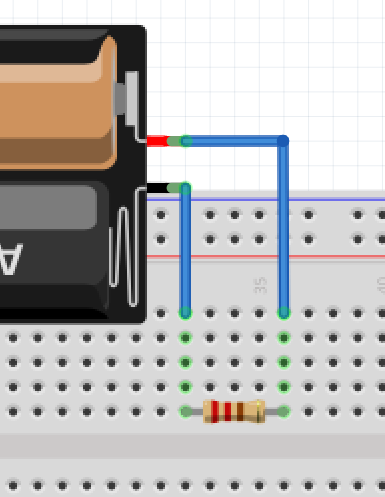

このように接続すると回路は以下のようになります
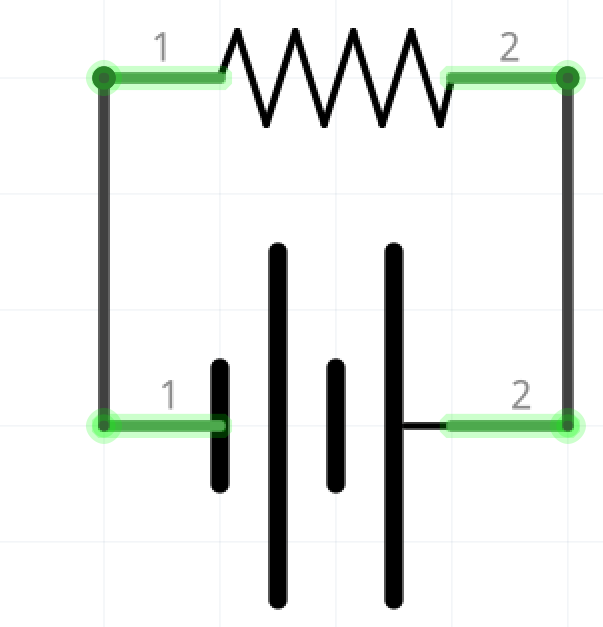

>ボードによっては図のように電源用、GND用の差込口が用意されているものもあります。
>この部分だけは他の部分と内部で接続されている方向が異なるので注意です。
>

## LEDについて
LEDは電圧をかけると光る素子です。


通常LEDは図のように長いピンと短いピンがあり、長い方をアノード(A)、短い方をカソード(K)と言います。
LEDは極性があるためアノードを＋に、カソードーに接続する必要があります。

また、マイコンやRaspberryPiの入出力ピン、電源に直接接続すると電流が流れすぎて破損する可能性があるので、流れる電流を制限する抵抗を挟む必要があります。


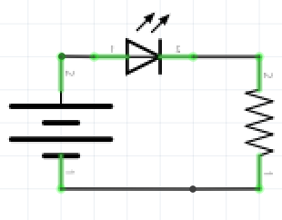

## raspberry Piのピン配置
RaspberryPiについているピンの対応表を示します。

出典 www.element14.com

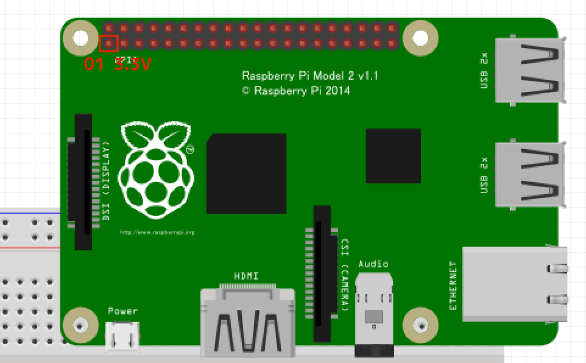

RaspberryPiのピンが並んでいる場所の左下の部分が1番3.3Vです。

RaspberryPiのピン配置は図のようになっています。
この内GPIOが入出力ピンで、このピンに様々な素子を接続します。
一部のGPIOはシリアル通信など特別な機能用に割当られています。（対応する機能を使わない場合はGPIOとして利用できます。）

また、3.3V電源、GNDの位置を把握しておいてください。

## RaspberryPiにLEDを接続
LEDをRaspberryPiから制御するため図のように接続します。
接続するGPIOのピンは任意ですが以下の例ではGPIO02に接続したものとします。

接続例(実体配線図)
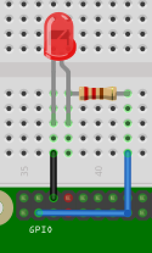
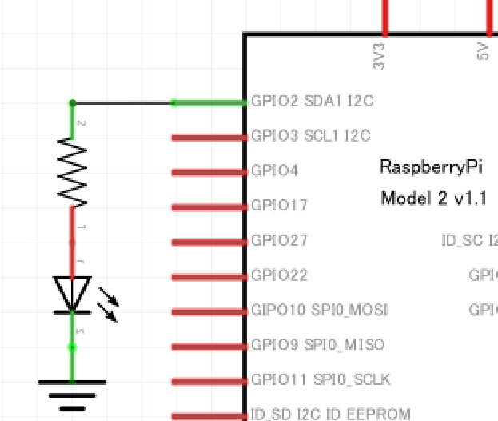

電源、GNDの位置とLEDの極性に注意して接続します。また、抵抗を挟むことを忘れないでください。

## PythonアプリからLEDを制御
raspbianの場合あるファイルを読み書きすることでGPIOを制御できますが、ここではPython用のライブラリRPi.GPIOを利用してGPIOを制御します。
なお、ファイルの読み書きをすればGPIOを制御できるためどの言語でもRaspberryPiの開発をすることが出来ます。

サンプルコードを以下に示します。

```python
import RPi.GPIO as GPIO # ライブラリの読み込み
import time             # sleepを呼ぶためtimeライブラリを読み込み

# 初期化
GPIO.setmode(GPIO.BCM)  # ピン番号の指定に物理的なピン番号ではなくてGPIO番号で指定(ピン対応表のGPIOXXのXXを指定する。)
GPIO.setup(2, GPIO.OUT) # GPIO02に出力モードを指定する

# 点滅処理
print("start")
for i in range(10):   # 10回ループする range(10)は0~9を順番に返してiに代入する C++のfor(int i =0; i < 10; i++)と等価s
    GPIO.output(2, 1) # GPIO02番に3.3V出力する (LEDが光る)
    time.sleep(0.5)   # 0.5秒待つ
    GPIO.output(2, 0) # GPIO02番に0V出力する (LEDが消える)
    time.sleep(0.5)
print("end")
# 終了処理
GPIO.cleanup()
```

このようなコードをJupyterNotebook上で作成して実行するとLEDが10回点滅します。
※各自のRaspberryPiで実行する場合はPythonファイルを作成してコンソールから実行してください。

> マイコンなどのGPIOは電源と同じHighレベルを出力するかGNDと同じLowレベルを出力するかの2つの値を出力するデジタル出力がメインです。
>その為GPIO.outputで2番目の引数に1を指定するとHighレベルである3.3Vが、0を指定するとLowレベルである0Vが出力されます。
>また、GPIO.outputは0,1の代わりにFalse, Ture出力を指定することも出来ます。

## ボタンの接続とプルアップ、プルダウン
小型のボタン（タクトスイッチ）は以下のようなもので様々なところで利用されています。

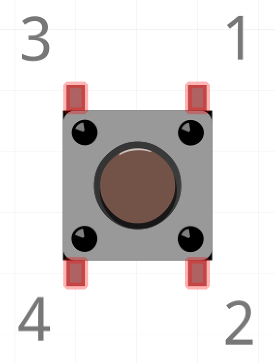

中の回路は下のようになっています。
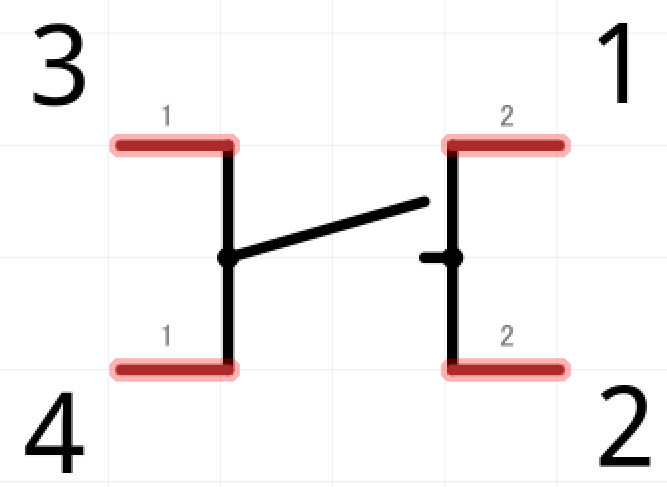

向きを間違えるとスイッチを押しても反応しないため下図のようにブレッドボードに挿し斜めに配線を行うのが無難です。
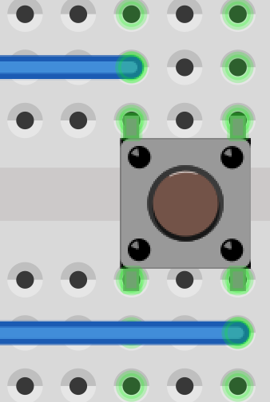

また、図のようにGPIOにつなげていない方のボタンの足をGNDに接続した場合、
おした時はGPIOにGNDが入力されますが、押していないときはどこにも接続されておらず、電圧が不安定になります。
そこで離しているときに電源と同じ電圧にする以下のような回路を組みます。


この離しているときに電源電圧と同じにすることをプルアップと言います。(この抵抗をプルアップ抵抗と言います。)

また、GPIOにつなげていない方の足を電源につなげた場合は押していないときはGNDになるように以下の回路を組みます。

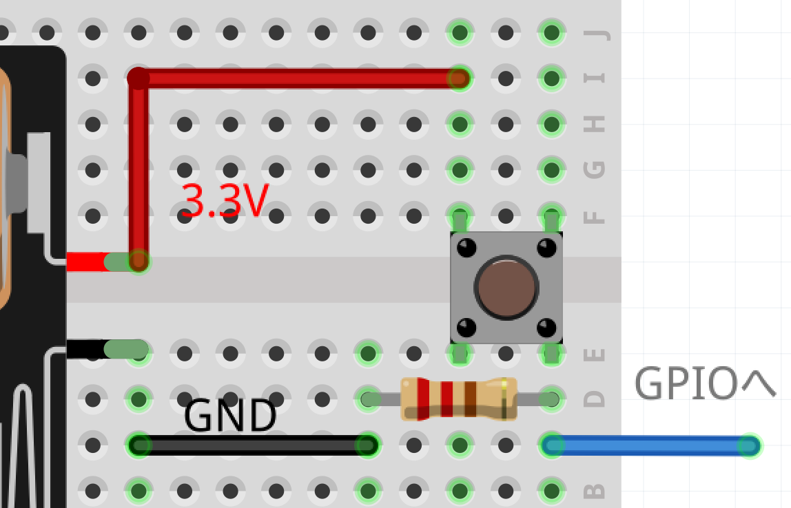

離しているときにGNDと同じにすることをプルダウンと言います。(この抵抗をプルダウン抵抗と言います。)

なお、実際にはGPIOにプルアップ抵抗やプルダウン抵抗を挿入する機能があるので上のような回路を組むことはあまりありません。

## ボタンが押されたかをPythonアプリから読み出す
実際にタクトスイッチを接続してみましょう。
ここの例ではGPIO05に接続し、ボタンを押すと電源につながるようにボタンを組みます。


次にPythonプログラムを組みます。
ボタンを押すと電源につながるようにスイッチを接続したため、プルダウン抵抗を挿入するように設定します。

```python
import RPi.GPIO as GPIO # ライブラリの読み込み
import time             # sleepを呼ぶためtimeライブラリを読み込み

# 初期化
GPIO.setmode(GPIO.BCM)  # ピン番号の指定に物理的なピン番号ではなくてGPIO番号で指定(ピン対応表のGPIOXXのXXを指定する。)
GPIO.setup(5, GPIO.IN, pull_up_down=GPIO.PUD_DOWN) #GPIO5番を入力として利用しプルダウン抵抗を挿入する

# ボタンが押されるまでループを回す

print("start")
# ループ処理
while True:
    print(".", end="")
    time.sleep(0.1) # 0.1秒待つ
    if GPIO.input(5): #GPIO5の入力状態を取得 押すと電源につながり3.3Vが入力される回路なので押されると1になる
        print("pressed")
        break # ループを抜ける

print("end")
# 終了処理
GPIO.cleanup()
```

このプログラムを実行するとボタンを押すまで.が表示され続けると思います。

上のコードのようにGPIO.inputでボタンの状態を取得した場合今現在押されているかどうかだけがわかります。
例えばボタンが離されたときにループを抜けたい場合は1ループ前のボタンの状態を変数に保持しておき、前の段階で押されていて、現在は押されていないという条件で判定します。

```python
# ループ処理
button_status = 0 # 変数初期化
while True:
    print(".", end="")
    time.sleep(1) # 1秒待つ
    if button_status and not GPIO.input(5): #前の状態で押されていて今押されていない
        print("released")
        break # ループを抜ける
    button_status = GPIO.input(5)

```
先程のコードをこのように書き換えて実行するとボタンを離したタイミングでループを抜けると思います。

## [課題]ボタンを押すとLEDの点灯状態が変わるプログラム
以上を踏まえてLED2とボタンをRaspberryPiのGPIOピンに接続し、ボタンを押すたびにもう片方のLEDを光らせるようなプログラムを作ってください。

GPIO.inputだけで判定する場合ボタンを押しっぱなしにした場合ループが回るたびにLEDが点滅するため、前のループの時のボタンの状態を保持し、ボタンが押し下げられたタイミングでLEDの点灯状態を切り替えてください。

ここではLEDをGPIO02, ボタンをGPIO05に接続した例の回路を示します。
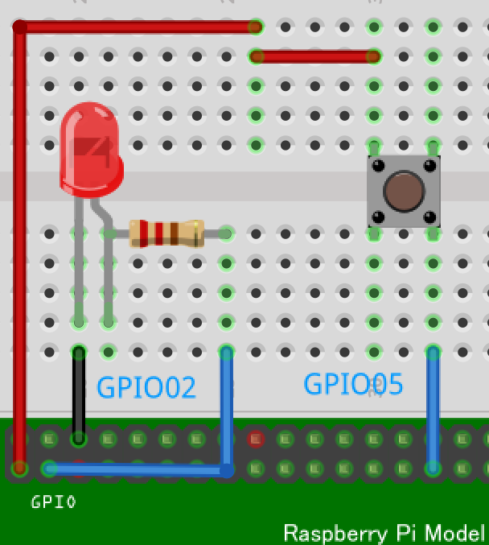

>なお、ボタンを押した瞬間は一瞬ボタンの接点がくっついたり離れたりを繰り返すためボタンの状態を取得するときは0.1秒間隔など適当な感覚で読み出すようにしてください。
>これをチャタリングと言います。

以下に雛形を用意します。
```python
import RPi.GPIO as GPIO # ライブラリの読み込み
import time             # sleepを呼ぶためtimeライブラリを読み込み

# GPIOの初期化
# ここにコードを書いてください。

# 状態を示す変数 Falseで消灯、Trueで点灯
led_status = False
# ボタンの状態を示す変数 押されている場合True
button_status = False

print("start")
try: # 今回はループを抜ける処理がないのでCtrl+Cなどで強制終了します。その際に例外処理をしないとcleanup()が呼ばれないため例外処理をしています。
    while True:
        time.sleep(0.1) # 0.1秒待つ(チャタリング対策)
        # ボタンの状態を取得し ボタンが押された場合はled_statusを切り替えLEDの点灯状態を更新してください。
        # 最後にbutton_statusを更新してください。
finally:
    # 例外が発生すると最後にここが呼ばれます
    print("end")
    # 終了処理
    GPIO.cleanup()
```

この課題を実装したものはled.pyです。
