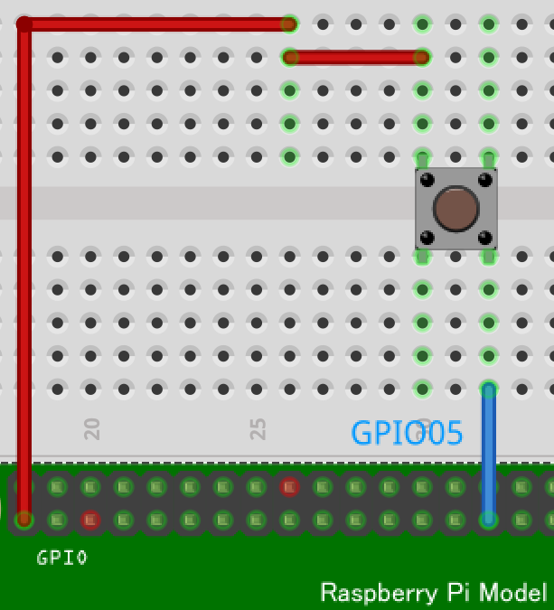
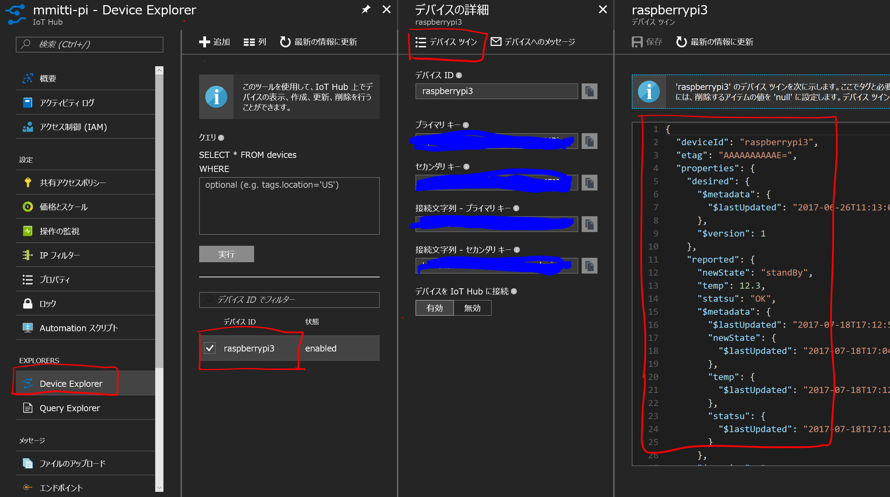

# #3 Azure IoT Hubにデータを送る

この章ではPython用に提供されているデバイス用のAzureIoTHubSDKを利用しAzureIoTHubにメッセージを送信し、実際に送信されているかをコンソールツールのiothub-explorerを使って確認します。

## AzureIoTHubSDKについて

AzureIoTHubに接続するためのSDKがPythonやNodejsなど複数の言語用に提供されています。
今回はPython用のSDKをもちいますが、Linux向けにコンパイル済みのライブラリは配布されていないため、自前でビルドする必要があります。
今回はこちらでコンパイル済みのものを提供しています。

コンパイル済みのライブラリを読み込むためiothub_client.soと同じフォルダーにソースコードやJupyterのノートブックを配置してください。

## AzureIoTHub クライアントを初期化する関数

AzureIoTHubと接続するクライアントクラスを初期化する関数を示します。（SDKのサンプルから抜粋)

```python
# ライブラリの読み込み
import iothub_client
from iothub_client import IoTHubClient, IoTHubTransportProvider
from iothub_client import IoTHubMessage, IoTHubError
# Azure IoTHubに接続するためのプロトコル HTTPやMQTTなど MQTTのほうがセンサー値などを送るのには向いている
PROTOCOL = IoTHubTransportProvider.MQTT
# メッセージを送信する時のタイムアウト時間[ms]
MESSAGE_TIMEOUT = 10000
# Device Explorerで確認した接続文字列
CONNECTION_STRING = "<接続文字列>"

# 初期化関係の関数
# この関数を呼ぶと初期化済みのIoTHubのクライアントクラスのインスタンスを返す
def iothub_client_init():
    from iothub_client_cert import CERTIFICATES
    # 指定した接続文字列とプロトコルでクライアントを作成
    client = IoTHubClient(CONNECTION_STRING, PROTOCOL)
    # タイムアウト時間を指定
    client.set_option("messageTimeout", MESSAGE_TIMEOUT)
    # 一部の環境では証明書情報が必要なので設定
    client.set_option("TrustedCerts", CERTIFICATES)
    # MQTTのログ機能を無効化
    client.set_option("logtrace", 0)
    return client
```

この関数を呼ぶとAzureIoTHubと接続できるクライアントクラスのインスタンスが帰ってきます。

## 10秒おきにメッセージを送る

上で定義した関数を使ってクライアントのインスタンスを作成し、試しにメッセージを送ってみます。

IoTHubにメッセージを送信するにはまず、メッセージの中身となる文字列を用意し、この文字列を元にIoTHubMessageクラスのインスタンスを作成します。
最後にIoTHubクライアントのsend_event_asyncメソッドにIoTHubMessageを渡すことでAzure IoTHubにメッセージが送信されます。

なお、送信処理は非同期で行われるため、送信結果を受け取るようのコールバック関数を用意します。

以下に10秒おきにカウンターを送信するサンプルを示します。

```python
import time #sleepを使うので追加でインポート

# 前節で紹介した初期化用メソッドと関連するインポートをここに入れてください。

# 送信後に呼び出されるコールバック
def send_confirmation_callback(message, result, user_context):
    print(user_context)
    print("Result" + str(result))

# 送信した回数を保持するカウンター
counter = 0
# クライアントのインスタンスを作成
client = iothub_client_init()
try: # 例外処理
    while True:
        msg = "count:" + str(counter) # カウンターを文字列に変換して文字列と結合しメッセージの中身を作る
        message = IoTHubMessage(msg) # 文字列からIoTHubのメッセージを作成

        # 実際に送信 送信には時間がかかるのでコールバック関数をわたし結果を受け取る
        # 第三引数はコールバック関数のuser_contextに渡される
        client.send_event_async(message, send_confirmation_callback, msg)

        counter += 1 # カウンターインクリメント
        time.sleep(10) # 10秒待つ

except: # 例外が発生したら終了
    import traceback
    traceback.print_exc() #例外情報を出力
    print("EXIT")

```
このコードの全体はsend_message.pyで添付します。
このコードを実行すると10秒おきにcount:1, count:2と言ったメッセージを送信します。

## AzureIoTHubに送信されたメッセージを確認する

IoTHubに送信されたメッセージはWebアプリやデータベスなどに接続することで保存したり表示したり出来ますが、ここではもっと簡単に確認できるiothub-explorerというコマンドラインツールを利用します。

NodeJSが導入されている環境であれば簡単にインストールできますが、ここではRaspberryPi上にインストールしたiothub-explorerを利用します。
(本来であれば別の端末で動かすべきですが、環境構築の手間の削減のためこのようにしています。)

jupyter上でコンソールを開きます（[参考](../JupyterNoteBook.md#コンソールを開く)）。

iothub-explorerを利用してメッセージを確認するには

```
iothub-explorer monitor-events <ここにデバイスのIDを入れてください> --login "<ここにサービス用の接続文字列を入れてください>"
```
を実行します。

※--loginのあとの接続文字列はダブルクォーテーションでくくってください

実行したあとメッセージがAzureIoTHubに送信されると以下のようにメッセージが表示されます。

```
Monitoring events from device raspberrypi3...
==== From: raspberrypi3 ====
count:8
---- properties ----
{}
====================
==== From: raspberrypi3 ====
count:9
---- properties ----
{}
====================
==== From: raspberrypi3 ====
count:10
---- properties ----
{}
====================
==== From: raspberrypi3 ====
count:11
---- properties ----
{}
====================
```

## [課題]ボタンを押してクラウドにデータを送る

実際にセンサー値を送る前にボタンを押すとボタンを押した回数を送信するものを作ってみましょう。
GPIO5に押したときにHighになるボタンを繋いだものとして実際に実装したものはbutton.pyです。

回路図



## おまけ プロパティーを送るには

センサー値など時系列データとは異なり、デバイスの状態（電池の残量や接続モードなど）を送る際はメッセージとしてではなく報告されたプロパティーとして送ると便利です。

（報告されたプロパティーはサービス側から検索などをかけて取得したり、Azureのポータルから確認することが可能です。また、AzureIoTHubに最新の値が格納されます。)

プロパティーを送信するにはメッセージを送信する処理に以下のように追加します。

```python
import json

# プロパティー送信後に呼ばれるコールバック
def send_reported_state_callback(status_code, user_context):
    print("status code:" + str(status_code))


# 現在の状態をマップで用意
status_map = {"statsu":"OK", "temp":12.3}
# マップからjsonという形式に変換
json_str = json.dumps(status_map)
# 送信する（最後に引数はコールバックのuser_contextに渡される)
client.send_reported_state(json_str, len(json_str), send_reported_state_callback, 0)

```

このサンプルの全体はsend_property.pyです。

実際にAzureIoTHub上に届いているかを確認するにはポータルにアクセスし、AzureIoTHubの管理ページから右側「デバイスエクスプローラー」を選択し、対象のデバイスを選択、「デバイスツイン」というボタンを押すと表示されます。



例(reportedの中に送信したプロパティーが入っています)
```
{
  "deviceId": "raspberrypi3",
  "etag": "AAAAAAAAAAE=",
  "properties": {
    "desired": {
      "$metadata": {
        "$lastUpdated": "2017-06-26T11:13:08.8562598Z"
      },
      "$version": 1
    },
    "reported": {
      "temp": 12.3,
      "statsu": "OK",
      "$metadata": {
        "$lastUpdated": "2017-07-18T17:12:56.241338Z",
        "temp": {
          "$lastUpdated": "2017-07-18T17:12:56.241338Z"
        },
        "statsu": {
          "$lastUpdated": "2017-07-18T17:12:56.241338Z"
        }
      },
      "$version": 3
    }
  }
}

```

メッセージと報告されたプロパティーの使い分けは[こちら](https://docs.microsoft.com/ja-jp/azure/iot-hub/iot-hub-devguide-d2c-guidance)を御覧ください。
